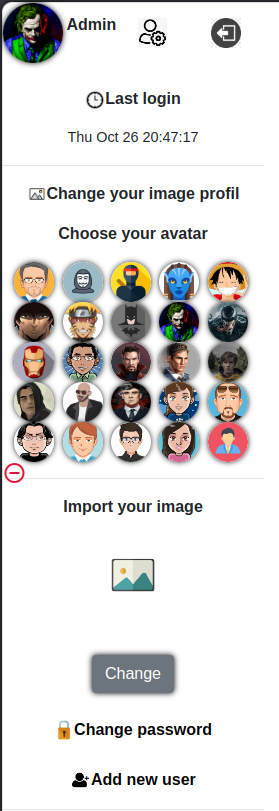
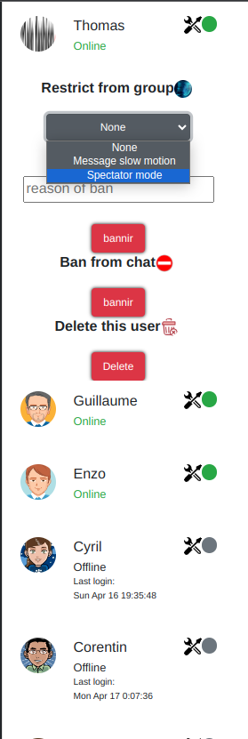
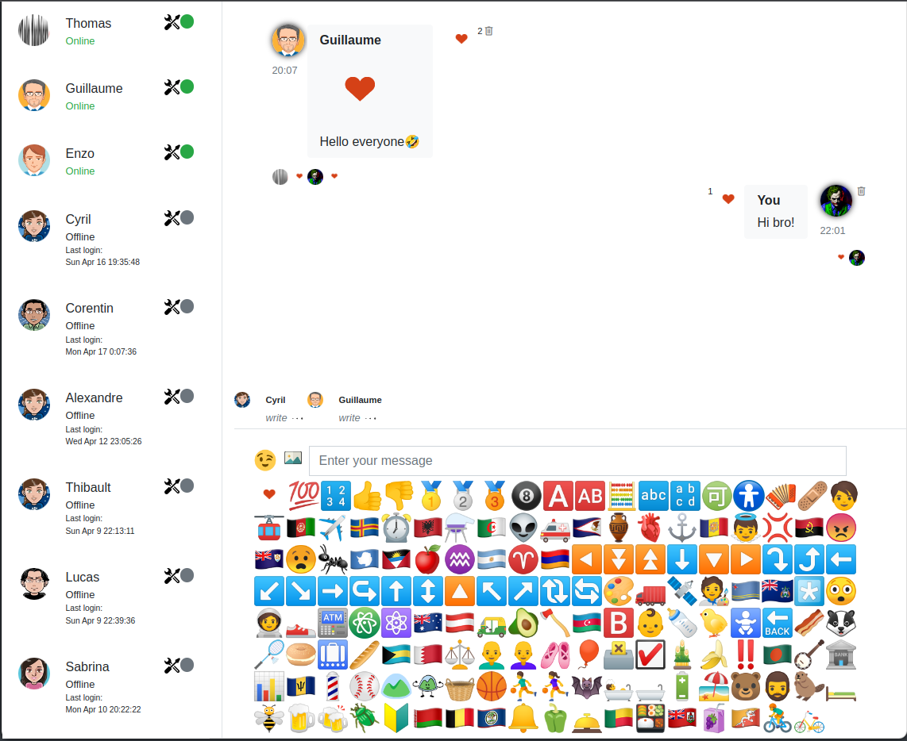

# Classroom-chat
<p align="center">
  
</p>
<i align="center">Edit your profile and choose your avatar! Administer each user in the group and control rights to obtain a chat that respects the rules!</i>
<p align="center">
  
   
</p>
<i align="center">Share your best comment and your best emoji!</i>
<p align="center">
  
</p>

**`Installation`**

<i>Make sure you have <b>PHP</b> and <b>Mysql</b> (phpmyadmin) installed before on your system</i>

```
$ git clone https://github.com/Lucstay11/Classroom-chat/
$ cd Classroom-chat/
```
<i>Edit the <b>Database/connect.php</b> and setup your database connection </i><br>
<i>Create a mysql database with <b>chat</b> name and then import the <b>chat.sql</b> file from this project</i>

**`Start the web server in local`**

```
$ php -S 0.0.0.0:1111
```
<i>You can also run the app with <b>Apache2</b> or <b>Nginx</b>!</i><br>
<i>Default password for admin is <b>admin</b></i>


